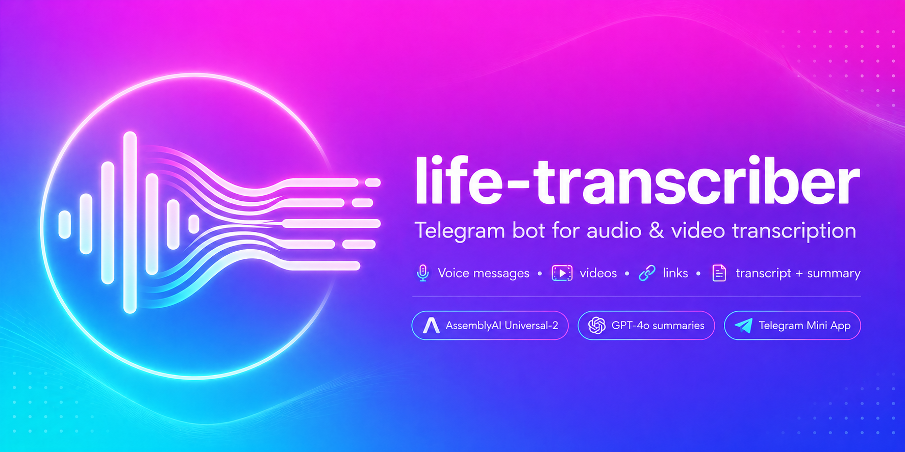

# life-transcriber

<p align="center">
  
</p>

<p align="center">
  
  
</p>

Персональный Telegram-бот для транскрибации аудио и видео через AssemblyAI
Universal-2 (с акустической диаризацией спикеров), с генерацией краткого
конспекта на GPT-4o.

## Что умеет

- 🎙 **Голосовые сообщения** — транскрибация в текст
- 🎥 **Видео-кружочки** (video notes) — транскрибация аудиодорожки
- 📼 **Видео-файлы** (`.mp4`, `.mov` и т.п., в том числе пересланные) — извлечение аудио + транскрибация
- 🔗 **Ссылки на видео** — YouTube, RuTube, VK Video, Vimeo и [многие другие платформы](https://github.com/yt-dlp/yt-dlp/blob/master/supportedsites.md) (всё, что поддерживает `yt-dlp`)
- 📸 **Instagram Reels/видео** — публичные ссылки вида `https://www.instagram.com/reel/...` и `/p/...` скачиваются через встроенный [Cobalt](https://github.com/imputnet/cobalt); если Instagram блокирует анонимный доступ с VPS, Cobalt можно запустить с `cookies.json`
- 📘 **Публичные видео и Reels Facebook** — ссылки `facebook.com/reel/…`, `facebook.com/watch?v=…`, `fb.watch/…` скачиваются через тот же встроенный Cobalt
- ☁️ **Публичные ссылки на Яндекс Диск** — аудио или видео-файлы вида `https://disk.yandex.ru/d/...` и `https://yadi.sk/d/...` качаются напрямую через публичный Cloud API (авторизация не требуется)
- 🎧 **Выпуски подкастов Яндекс Музыки** — ссылки на конкретный выпуск вида `https://music.yandex.ru/album/.../track/...` сначала скачиваются через открытый RSS подкаста, затем через `yt-dlp`; ссылка на весь подкаст не запускает массовую скачку
- 📤 **Mini App для больших файлов** — кнопка «Транскрибации» в меню бота открывает Telegram WebView, куда можно загрузить аудио или видео любого размера (нет ограничения 20 MB от Bot API). Backend готовит компактное audio-only MP3 перед транскрибацией. Требует HTTPS-домена и настройки shared Caddy на VPS (см. ниже)
- 📝 **Краткий конспект** — inline-кнопка под транскрибацией, генерирует тезисы через GPT-4o; длинные тексты обрабатываются фрагментами и собираются в единый конспект
- 🧹 **Очистка полной транскрибации** — у транскрибаций, которые приходят `.txt`-файлом, есть кнопка «Очистить текст»: бот убирает слова-паразиты, повторы, паузы и грязные формулировки, сохраняя исходную структуру и смысл
- ⏳ **Интерактивный статус** — во время обработки присылается одно сообщение с анимированным прогресс-баром и фазами («Скачиваю…» → «Транскрибирую…» → «Отправляю результат…»); тот же бар показывается для «Делаю краткий конспект…» и «Очищаю текст…» с прогрессом по чанкам N/M; сообщение удаляется, когда результат отправлен, или превращается в текст ошибки, если что-то сломалось
- 🔤 **Word boost для специфичных терминов** — список доменных слов (имена, бренды, технические термины) поднимает точность распознавания. Поддерживается до ~1000 слов на запрос; редактируется в `bot/data/word_boost.txt` без пересборки образа (директория монтируется как volume).
- 🕒 **Выбор формата до генерации** — получив ссылку или медиа, бот спрашивает «С таймкодами / Без таймкодов»; транскрибация стартует после нажатия, кнопка «✖️ Отменить транскрибацию» удаляет запрос без запуска. В форме Mini App — переключатель «Таймкоды в файле»
- 💾 **Хранение генераций** — каждая готовая транскрибация сохраняется на сервере (SQLite + `.txt` без таймкодов + JSON с таймингами предложений); версия с таймкодами рендерится по запросу
- 🗂 **Вкладка «Мои записи» в Mini App** — список своих генераций (заголовок, канал/автор источника, дата, длительность): прислать в чат (обычную или с таймкодами), удалить вместе с файлом
- 🤖 **REST API для агентов** — список/скачивание/удаление/пересылка генераций по bearer-токену (`API_TOKENS`); каждый пользователь видит только свои записи

**Формат ответа:**
- Короткий текст (≤ 2000 символов) — приходит прямо в чате
- Длинный текст — приходит файлом `.txt` (имя файла строится из заголовка материала): первая строка — заголовок (оригинальное название видео из метаданных yt-dlp / Яндекс Музыки; если оно отсутствует или выглядит как ID/хэш — `dQw4w9WgXcQ` — генерируется GPT-4o). Если у источника известен канал/автор, второй строкой идёт `📺 Канал: <имя>` — та же шапка выносится в caption у документа (заголовок **жирным**, строка с каналом — _курсивом_; внутри .txt-файла шапка plain). Дальше — текст с таймкодами: имя спикера отдельной строкой, под ним строки `[м:сс.ммм] текст` (или `[ч:мм:сс.ммм]` для записей длиннее часа); каждое предложение — своя строка, таймкод = начало первого слова предложения (word-level таймстемпы AssemblyAI), предложения никогда не рвутся посередине. Диаризация делается AssemblyAI по голосу, а не по тексту, поэтому метки «Спикер 1», «Спикер 2» стабильны на всём протяжении и не путаются. Для моно-записи строк с именем спикера нет — только таймкод-строки. В коротких ответах в чате таймкодов нет.

**Доступ:** по whitelist Telegram user ID. Случайные пользователи не получают ответа.

**Команды бота:**
- `/start`, `/help` — приветствие со списком поддерживаемых входов, описанием лимитов и доступных команд
- `/limit` — показать текущий месячный лимит транскрибации, использовано и остаток. Для пользователей без лимита отвечает «Лимит на транскрибации не установлен.»

**Месячные лимиты часов транскрибации (опционально):** для конкретных пользователей можно задать месячный лимит в часах. Лимиты живут в `bot/data/user_limits.json` (формат `{"<telegram_user_id>": <hours>}`). Расход считается по календарным месяцам UTC и сохраняется в `data/usage.json` (writable volume). Пользователи без записи в `user_limits.json` имеют безлимит. При превышении лимита бот отвечает: «Превышен текущий лимит по часам транскрибации в месяц. Ваш текущий лимит — N часов.» (с правильной плюрализацией). Списание идёт по фактическому duration аудио из ответа AssemblyAI после успешной транскрибации, поэтому в последнем запросе возможен небольшой перерасход — следующий запрос будет заблокирован.

## Ориентировочная стоимость

Все расходы идут напрямую на твои API-аккаунты. Ориентир за **1 час аудио/видео**:

| Сервис | Что | Цена |
|---|---|---|
| AssemblyAI | Транскрибация Universal-2 + диаризация спикеров | ~$0.37 |
| OpenAI GPT-4o | Распознавание имён спикеров (и заголовка, когда у источника нет своего названия) | ~$0.03 |
| OpenAI GPT-4o | Краткий конспект (кнопка, опционально) | ~$0.04–0.07 |
| **Итого** | без конспекта / с конспектом | **~$0.40 / ~$0.45–0.50** |

Цифры актуальны на апрель 2026. Проверяй актуальные тарифы:
[AssemblyAI Pricing](https://www.assemblyai.com/pricing) · [OpenAI Pricing](https://openai.com/api/pricing)

## Стек

- Python 3.11+
- [aiogram 3.x](https://github.com/aiogram/aiogram) — async Telegram Bot framework
- [AssemblyAI](https://www.assemblyai.com/) — транскрибация (Universal-2: ~<5% WER, 99 языков) + акустическая диаризация спикеров (95 языков включая русский)
- [OpenAI API](https://platform.openai.com/docs/api-reference) — GPT-4o для заголовков и конспектов
- [yt-dlp](https://github.com/yt-dlp/yt-dlp) — скачивание с видео-платформ
- [Cobalt](https://github.com/imputnet/cobalt) — скачивание видео из Instagram (self-hosted Docker-sidecar)
- [FFmpeg](https://ffmpeg.org/) — извлечение аудио из видео
- [FastAPI](https://fastapi.tiangolo.com/) — веб-сервис для Telegram Mini App (загрузка файлов)
- [Caddy](https://caddyserver.com/) — shared reverse proxy на VPS с автоматическим TLS (Let's Encrypt)
- [Telegram Mini Apps](https://core.telegram.org/bots/webapps) — WebView для загрузки файлов без ограничений Bot API
- Docker + Docker Compose

## Как развернуть свой

### 1. Форкни или склонируй репозиторий

```bash
git clone https://github.com/USER/life-transcriber.git
cd life-transcriber
```

### 2. Получи необходимые ключи и ID

**Telegram bot token:**
1. Открой [@BotFather](https://t.me/BotFather) в Telegram
2. Отправь `/newbot`, следуй инструкциям
3. Сохрани токен вида `1234567890:ABCdef...`

**OpenAI API key:**
1. Зайди на https://platform.openai.com/api-keys
2. Создай новый ключ — начинается с `sk-...` или `sk-proj-...`
3. Пополни баланс на https://platform.openai.com/account/billing
   (минимум $5 — без баланса API не работает)

**AssemblyAI API key:**
1. Зайди на https://www.assemblyai.com/ и зарегистрируйся
2. В дашборде скопируй API key — длинная строка, видна сразу на главной странице

**Telegram user ID:**
1. Напиши боту [@userinfobot](https://t.me/userinfobot) команду `/start`
2. Он пришлёт твой ID (число типа `123456789`)
3. Повтори для каждого, кому даёшь доступ

### 3. Настрой `.env`

```bash
cp .env.example .env
```

Открой `.env` и заполни:

```env
BOT_TOKEN=1234567890:ABCdef...
OPENAI_API_KEY=sk-proj-...
ASSEMBLYAI_API_KEY=your_assemblyai_api_key_here
ALLOWED_USER_IDS=123456789,987654321
```

Опциональные переменные (дефолты в `.env.example`):
- `LONG_TEXT_THRESHOLD=2000` — порог длины текста, после которого ответ идёт файлом
- `MIN_SUMMARY_LEN=500` — минимальная длина текста (символов), при которой появляется кнопка «📝 Краткий конспект»
- `ASSEMBLYAI_SPEECH_MODEL=universal` — модель AssemblyAI (`universal` | `nano` | `slam-1`)
- `FORCE_LANGUAGE_CODE=` — если задан (например `ru`), отключает автодетект языка; полезно для коротких клипов < 30 сек, где автодетект нестабилен
- `WORD_BOOST_FILE=bot/data/word_boost.txt` — путь к файлу с доменными терминами (по одному на строку, комментарии через `#`); директория монтируется volume, можно пополнять без пересборки образа
- `WORD_BOOST_LEVEL=high` — сила буста терминов (`low` | `default` | `high`)
- `CUSTOM_SPELLING_FILE=bot/data/custom_spelling.json` — JSON-карта `{"распознанная форма": "правильная форма"}` для пост-обработки текста
- `GPT_MODEL=gpt-4o` — модель для конспекта и заголовков
- `TEMP_DIR=/tmp/transcriber` — где хранить временные файлы
- `COBALT_API_URL=http://cobalt:9000` — адрес Cobalt API для Instagram/Facebook (по умолчанию Docker-DNS)
- `INSTAGRAM_COOKIES_PATH=` — опциональный путь к Cobalt-style `cookies.json` внутри bot-контейнера; используется как fallback, если Cobalt возвращает `error.api.fetch.empty`
- `YTDLP_PROXY=` — опциональный proxy для всех скачиваний через `yt-dlp`
- `YANDEX_MUSIC_PROXY=` — proxy только для Яндекс Музыки; нужен, если VPS получает HTTP 451 из-за региона
- `WEBAPP_URL=https://transcriber.example.com` — публичный URL Mini App; если задан, бот ставит кнопку меню «Транскрибации» (требует shared Caddy на VPS, см. ниже)
- `API_TOKENS=` — bearer-токены для REST API в формате `token1:user_id1,token2:user_id2`; токен даёт доступ только к генерациям замапленного пользователя
- `TRANSCRIPTS_DB_FILE=data/transcripts.db` — SQLite с метаданными сохранённых транскрибаций
- `TRANSCRIPTS_DIR=data/transcripts` — директория с `.txt`/`.json` файлами генераций

### 4. Запусти через Docker

```bash
docker compose up -d --build
```

Проверь логи:
```bash
docker compose logs -f
```

Должно быть:
```
Bot started. Allowed users: [...]
Start polling
Run polling for bot @YourBotName
```

### 5. Используй

Напиши своему боту в Telegram:
- Запиши **голосовое** → получи текст
- Запиши **кружочек** → получи текст
- Отправь **видео** (как файл или пересланное) → получи текст
- Вставь **ссылку на видео** → получи текст
- Вставь **публичную ссылку на аудио/видео в Яндекс Диске** → получи текст
- Вставь **ссылку на публичный Instagram Reel или видео-пост** → получи текст
- Вставь **ссылку на публичное видео или Reel из Facebook** (`facebook.com`, `fb.watch`) → получи текст
- Вставь **ссылку на конкретный выпуск подкаста Яндекс Музыки** (`music.yandex.ru/album/.../track/...`) → получи текст
- Под любой транскрибацией нажми **«📝 Краткий конспект»** → получи тезисы
- Под транскрибацией, которая пришла `.txt`-файлом, нажми **«🧹 Очистить текст»** → получи полную очищенную версию в том же порядке и формате блоков, файл придёт с подписью `Очищенный текст: <Заголовок>`
- После отправки ссылки или медиа бот спросит **«С таймкодами / Без таймкодов»** — транскрибация стартует по нажатию; **«✖️ Отменить транскрибацию»** удаляет запрос без запуска
- Нажми кнопку **«Транскрибации»** в меню бота → загрузи любой файл без ограничений → получи текст (требует `WEBAPP_URL` и shared Caddy)
- Во вкладке **«Мои записи»** Mini App — все сохранённые генерации: пришли в чат (обычную или с таймкодами) или удали; после отправки Mini App закрывается, прогресс и результат видны в чате

## Деплой на VPS

На сервере с Ubuntu 22.04+:

```bash
# Установка Docker (если ещё нет)
apt update && apt install -y ca-certificates curl gnupg
install -m 0755 -d /etc/apt/keyrings
curl -fsSL https://download.docker.com/linux/ubuntu/gpg | gpg --dearmor -o /etc/apt/keyrings/docker.gpg
echo "deb [arch=$(dpkg --print-architecture) signed-by=/etc/apt/keyrings/docker.gpg] https://download.docker.com/linux/ubuntu $(. /etc/os-release && echo $VERSION_CODENAME) stable" > /etc/apt/sources.list.d/docker.list
apt update && apt install -y docker-ce docker-ce-cli containerd.io docker-compose-plugin

# Деплой
git clone https://github.com/USER/life-transcriber.git /opt/life-transcriber
cd /opt/life-transcriber
# Создай .env с реальными ключами (НЕ коммить его!)
docker compose up -d --build
```

Обновление после изменений:
```bash
git pull && docker compose up -d --build
```

Если все ссылки Instagram внезапно падают на стороне Cobalt:

1. Сначала обнови sidecar-образ и перезапусти Cobalt:

```bash
docker compose pull cobalt
docker compose up -d cobalt
```

2. Если Cobalt всё ещё возвращает ошибку вида `error.api.fetch.fail`, Instagram,
   скорее всего, блокирует анонимное скачивание с VPS. Создай `cookies.json` рядом
   с `docker-compose.yml` в формате Cobalt и не коммить этот файл. Затем раскомментируй
   в `docker-compose.yml`:

```yaml
environment:
  API_URL: "http://cobalt:9000"
  COOKIE_PATH: "/cookies.json"
volumes:
  - ./cookies.json:/cookies.json:ro
```

После этого перезапусти Cobalt:

```bash
docker compose up -d cobalt
```

Формат cookie-файла описан в документации Cobalt: `docs/examples/cookies.example.json`.
Если Cobalt загрузил cookies, но всё равно возвращает `error.api.fetch.empty`,
можно подключить тот же файл к bot-контейнеру и выставить
`INSTAGRAM_COOKIES_PATH=/cookies.json`: бот попробует получить `video_versions`
напрямую через Instagram API.

## Mini App: загрузка файлов без ограничений

Telegram Bot API позволяет боту скачивать файлы только до 20 MB. Mini App
обходит это: файл уходит браузером напрямую на наш HTTPS-сервер, минуя Bot API.

**Как работает:**
1. Пользователь тапает «Транскрибации» → открывается WebView
2. Выбирает файл (аудио или видео любого размера)
3. Файл уходит POST-запросом на `/api/upload` с HMAC-подписью Telegram; в Mini App виден прогресс-бар загрузки с процентами
4. Как только файл принят, Mini App показывает зелёный статус и закрывается — транскрибация идёт в фоне
5. Backend проверяет подпись и whitelist, готовит audio-only MP3 через FFmpeg и транскрибирует через AssemblyAI; в чате в это время обновляется то же единое статус-сообщение с прогресс-баром, что и для ссылок («Готовлю аудио…» → «Транскрибирую…»)
6. Результат приходит в обычный чат бота

Временные файлы в `TEMP_DIR` очищаются при старте сервисов и далее раз в час:
удаляются файлы старше 6 часов.

**Что нужно для активации:**
- Домен с A-записью на VPS
- Shared Caddy развёрнут на VPS (см. «VPS: shared Caddy»)
- `WEBAPP_URL=https://transcriber.yourdomain.com` в `.env`

## REST API транскрибаций

Webapp отдаёт REST API для управления сохранёнными генерациями — как для вкладки
«Мои записи» в Mini App (auth через `X-Telegram-Init-Data` header), так и для
внешних агентов (bearer-токен из `API_TOKENS`).

Каждый пользователь видит только свои генерации; чужой или несуществующий id
всегда даёт `404`. Без auth — `401`.

```bash
BASE=https://transcriber.<your-domain>
TOKEN=<your-api-key>

# Список своих генераций (новые сверху)
curl -H "Authorization: Bearer $TOKEN" $BASE/api/transcripts

# Скачать конкретную генерацию .txt-файлом
curl -OJ -H "Authorization: Bearer $TOKEN" $BASE/api/transcripts/<id>/file

# Переслать генерацию в чат бота (обычная / с таймкодами)
curl -X POST -H "Authorization: Bearer $TOKEN" -H "Content-Type: application/json" \
  -d '{"timecoded": false}' $BASE/api/transcripts/<id>/resend

# Удалить генерацию (вместе с файлами на диске)
curl -X DELETE -H "Authorization: Bearer $TOKEN" $BASE/api/transcripts/<id>
```

Хранилище: метаданные в SQLite (`data/transcripts.db`, WAL), контент в
`data/transcripts/<id>.txt` (без таймкодов) и `<id>.json` (тайминги предложений).
Бот и webapp пишут в одну БД через общий volume — это рассчитано на локальный
диск одной машины; на сетевых ФС (NFS и т.п.) SQLite в таком режиме не работает.

## VPS: shared Caddy (reverse proxy для всех проектов)

Caddy не входит в этот репозиторий — он живёт на VPS как общая инфраструктура.
Это позволяет держать несколько проектов (ботов, приложений) на разных поддоменах
одного домена, без конфликта за порты 80/443.

### Первый раз: развернуть Caddy

```bash
# На VPS (один раз):
mkdir -p /opt/caddy && cd /opt/caddy
docker network create caddy_net
```

`/opt/caddy/docker-compose.yml`:
```yaml
services:
  caddy:
    image: caddy:2
    container_name: caddy
    restart: unless-stopped
    ports: ["80:80", "443:443"]
    volumes:
      - ./Caddyfile:/etc/caddy/Caddyfile:ro
      - caddy_data:/data
      - caddy_config:/config
    networks: [caddy_net]

networks:
  caddy_net:
    external: true

volumes:
  caddy_data:
  caddy_config:
```

`/opt/caddy/Caddyfile` (пример с одним проектом):
```
{
    email your@email.com
}

transcriber.yourdomain.com {
    encode gzip
    request_body { max_size 10GB }
    reverse_proxy webapp:8000
}
```

```bash
cd /opt/caddy && docker compose up -d
```

Firewall: `ufw allow 80 && ufw allow 443`.

### Добавить route для этого проекта

После деплоя life-transcriber добавь в `/opt/caddy/Caddyfile`:
```
transcriber.yourdomain.com {
    encode gzip
    request_body { max_size 10GB }
    reverse_proxy webapp:8000
}
```

Hot reload без даунтайма:
```bash
cd /opt/caddy && docker compose exec caddy caddy reload --config /etc/caddy/Caddyfile
```

Caddy автоматически получит Let's Encrypt cert при первом обращении к домену.

> **Важно:** DNS A-запись должна указывать напрямую на IP VPS (не через Cloudflare
> proxy — иначе загрузка больших файлов будет ограничена Cloudflare). Используй
> режим «DNS only» (серая тучка) в Cloudflare, если используешь его для DNS.

### Добавление следующего проекта

Просто добавь блок в `/opt/caddy/Caddyfile` и сделай reload — Caddy видит все
контейнеры, подключённые к `caddy_net`, по их Docker-именам.

## Безопасность

- `.env` с реальными ключами **никогда** не коммитится (уже в `.gitignore`)
- В репозиторий попадает только `.env.example` с плейсхолдерами
- Доступ к боту — только по whitelist Telegram user ID в `ALLOWED_USER_IDS`
- Пользователи вне whitelist не получают ответа (бот молчит, не раскрывает своё существование)

## Структура проекта

```
life-transcriber/
├── bot/
│   ├── main.py                  # Точка входа; ставит menu button если WEBAPP_URL задан
│   ├── config.py                # Pydantic Settings (читает .env)
│   ├── handlers/
│   │   ├── voice.py             # voice + video_note (кружочки) → вопрос «с таймкодами/без»
│   │   ├── video.py             # видео-файлы и document/video → вопрос «с таймкодами/без»
│   │   ├── links.py             # URL → вопрос → yt-dlp → transcribe (process_link)
│   │   ├── _tg_media.py         # скачивание Telegram-файла + запуск пайплайна (process_tg_media)
│   │   ├── _timecode_prompt.py  # ask_timecodes: регистрирует pending job + клавиатура вопроса
│   │   ├── commands.py          # /start, /limit
│   │   └── callbacks.py         # кнопки «Краткий конспект», «Скопировать», выбор tc:
│   ├── services/
│   │   ├── transcriber.py       # AssemblyAI Universal-2: транскрибация + диаризация → FormattedTranscript (title + uploader)
│   │   ├── source_meta.py       # SourceMetadata: title/uploader источника + title_is_filename (имя файла — hint для GPT, не заголовок)
│   │   ├── formatter.py         # render_with_speakers (A/B → Спикер 1/2) + analyze_transcript: title/speakers через GPT-4o (GPT-title используется, если source_meta.title — хэш или имя файла)
│   │   ├── summarizer.py        # OpenAI GPT-4o → конспект, chunking длинных текстов
│   │   ├── instagram.py         # Instagram Reels через Cobalt API
│   │   ├── facebook.py          # Facebook Videos/Reels через Cobalt API
│   │   ├── cobalt_client.py     # Общий клиент для Cobalt API (Instagram/Facebook)
│   │   ├── yandex_disk.py       # Публичное API Яндекс Диска; раздельные таймауты API/скачивания
│   │   ├── yandex_music.py      # URL выпусков подкастов Яндекс Музыки
│   │   ├── ffmpeg_runner.py     # Общий запуск FFmpeg с единым error handling
│   │   ├── media.py             # Подготовка audio-only MP3 через FFmpeg
│   │   ├── stream_download.py   # Общая потоковая запись HTTP-скачиваний во временный файл
│   │   ├── word_boost.py        # load_word_boost / load_custom_spelling / apply_custom_spelling
│   │   ├── transcription_pipeline.py # Общий flow: pre-check лимита → transcribe → списание → сохранение → deliver
│   │   ├── transcript_store.py  # Персистентное хранилище генераций: SQLite + .txt/.json файлы
│   │   ├── pending_jobs.py      # In-memory реестр задач, ждущих выбора «с таймкодами/без» (TTL 1 ч)
│   │   ├── usage_store.py       # Per-user месячные лимиты часов + расход (JSON-стор)
│   │   ├── temp_cleanup.py      # Периодическая очистка старых файлов из TEMP_DIR
│   │   ├── user_facing_error.py # Типизированные provider-ошибки без потери старого текста
│   │   └── downloader.py        # Диспетчер: Яндекс Диск / Instagram / Facebook / Яндекс Музыка / yt-dlp + FFmpeg
│   ├── data/
│   │   ├── word_boost.txt       # доменные термины для AssemblyAI word_boost (по одному на строку)
│   │   ├── custom_spelling.json # JSON-карта для пост-замен в тексте
│   │   ├── user_limits.example.json # Пример формата лимитов часов
│   │   └── user_limits.json     # (gitignored) per-user лимиты часов в месяц
│   ├── middlewares/auth.py      # Whitelist Telegram user ID
│   └── utils/
│       ├── text.py              # reply_text_or_file + кэш хэшей с TTL 10 мин
│       ├── text_chunking.py     # split_long_text: общий чанкер для summarizer/formatter
│       ├── fake_progress.py     # ровный прогресс-бар для операций без реального сигнала
│       ├── pluralize.py         # plural_ru, format_hm для русских числительных
│       └── progress.py          # ProgressReporter: один статус с анимированным баром
├── webapp/                      # Telegram Mini App (FastAPI)
│   ├── main.py                  # FastAPI app; POST /api/upload; static mount
│   ├── auth.py                  # validate_init_data: HMAC-SHA256 по BOT_TOKEN
│   ├── deps.py                  # resolve_user_id: bearer-токен или initData-header
│   ├── transcripts_api.py       # REST API: list / file / delete / resend
│   ├── delivery.py              # send_transcript_to_chat(bot, chat_id, text)
│   ├── Dockerfile
│   └── static/
│       ├── index.html           # TWA UI: вкладки «Загрузить» / «Мои записи»
│       └── app.js               # upload + список генераций (в чат / с таймкодами / удалить)
├── data/                        # (gitignored) writable runtime state: usage.json, transcripts.db, transcripts/
├── tests/                       # pytest
├── Dockerfile                   # для bot-сервиса
├── docker-compose.yml           # сервисы: bot, cobalt, webapp
├── requirements.txt
├── requirements-webapp.txt      # fastapi, uvicorn, python-multipart
├── requirements-dev.txt
└── .env.example
```

**Shared Caddy** (не в репо, живёт на VPS в `/opt/caddy/`) — reverse proxy,
роутит `transcriber.<domain>` → `webapp:8000` через docker network `caddy_net`.

## Тесты

```bash
python3 -m venv .venv
source .venv/bin/activate
pip install -r requirements-dev.txt
pytest -v
```

Покрыта ключевая логика: парсинг конфига, whitelist-авторизация, кэш текстов с TTL,
порог inline/file, URL regex, chunked-конспекты, HMAC-валидация Mini App initData,
доставка транскрибации, cleanup временных файлов, хранилище генераций
(SQLite + файлы, изоляция по user_id), REST API транскрибаций (двойная auth),
pending-реестр выбора таймкодов.

## Правила разработки

См. [CLAUDE.md](CLAUDE.md) — правила прогона тестов и работы с тестами при изменениях.

## Лицензия

[CC BY-NC 4.0](LICENSE) — личное некоммерческое использование.
